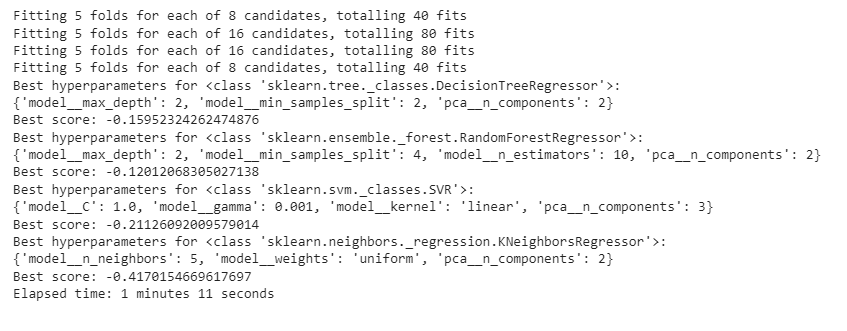
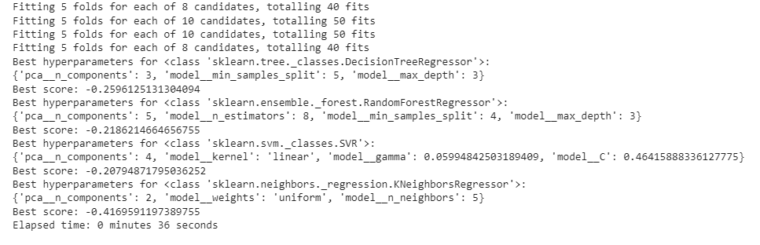
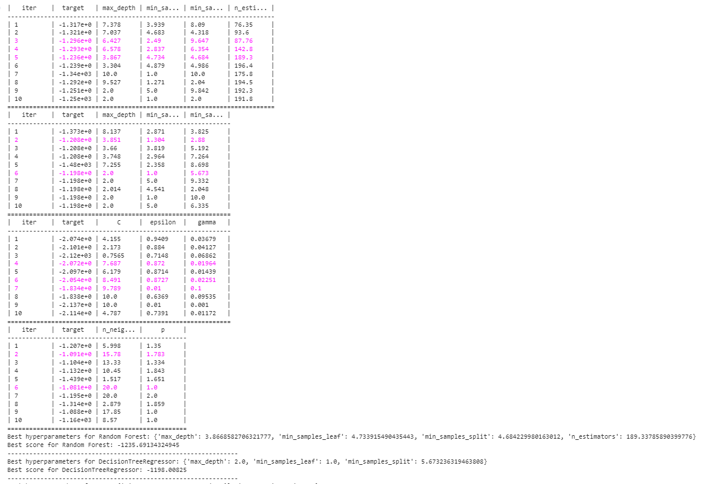
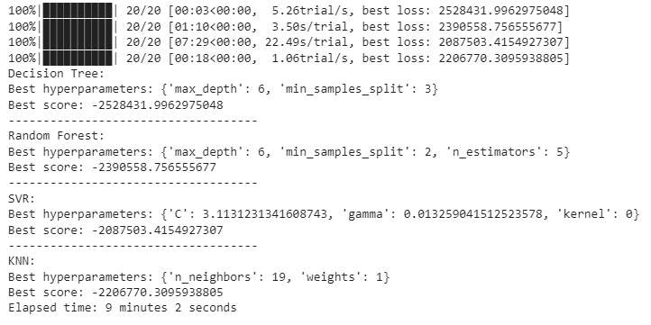
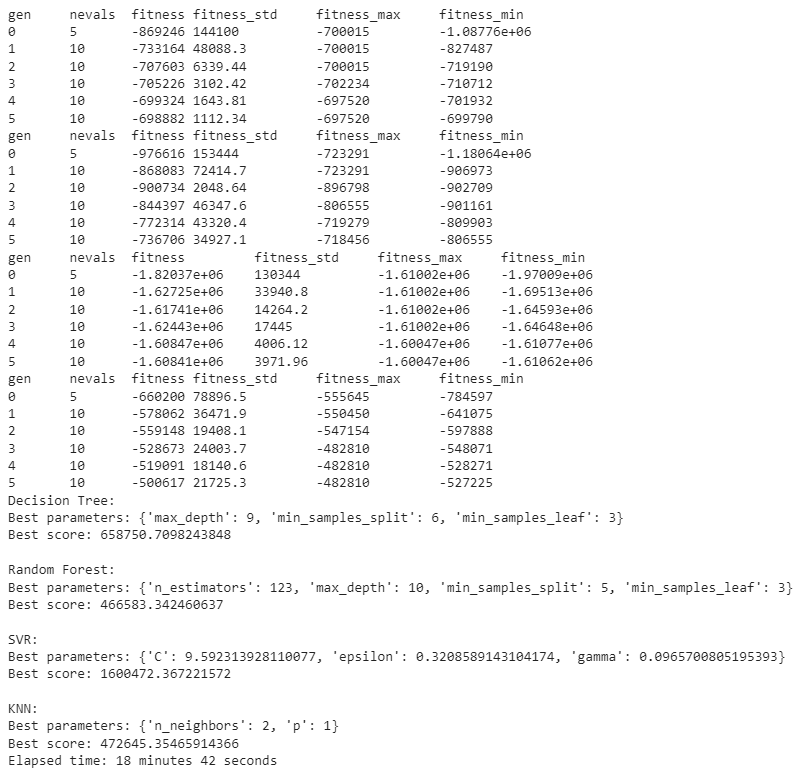

# Project Title :
Machine Learning-Predictive-Modeling-of-PM10-Pollution-Project.

## Project Overview :
In response to the pervasive issue of poor air quality in Skopje, this project focuses on predicting PM10 particle levels in the Centar location. 
Utilizing the "Centar_cleaned" dataset, which includes various environmental metrics, our goal is to build a machine learning model capable of forecasting PM10 pollution. 

## Project Highlights :
    
- **Dataset Information:** The dataset includes various features such as PM10, apparent temperature, cloud cover, dew point, humidity, precipitation intensity and probability, pressure, temperature, UV index, visibility, wind bearing, wind gust, wind speed, weather conditions, hour, day, and month.

- **Tasks:**
  1. **Exploratory Data Analysis (EDA):** Applying EDA techniques to clean up the dataset for better model predictions.
  
  2. **Model Training:** Training several models and comparing their performances to select the best one.
  
  3. **Hyperparameter Optimization Techniques:** Applying various hyperparameter optimization techniques (Grid Search CV, Random Search CV, Bayesian Optimization, Genetic Algorithm, TPOT Classifier) to fine-tune the best model.
     
## Project Preview :
## Summary:
GRID SEARCH CV FOR DECISION TREE, RANDOM FOREST, SVR AND KNN REGRESSION MODELS WITH PIPLINES.

RANDOM SEARCH CV FOR DECISION TREE, RANDOM FOREST, SVR AND KNN REGRESSION MODELS WITH PIPLINES.

BAYESIAN OPTIMIZATION FOR DECISION TREE, RANDOM FOREST , SVR AND KNN REGRESSION MODELS WITH BAYES_OPT.

BAYESIAN OPTIMIZATION FOR DECISION TREE, RANDOM FOREST ,SVR AND KNN REGRESSION MODELS WITH HYPEROPT.

GENETIC ALGORITHM OPTIMIZATION FOR DECISION TREE, RANDOM FOREST, SVR AND KNN REGRESSSION MODELS.

TPOT Classifier

